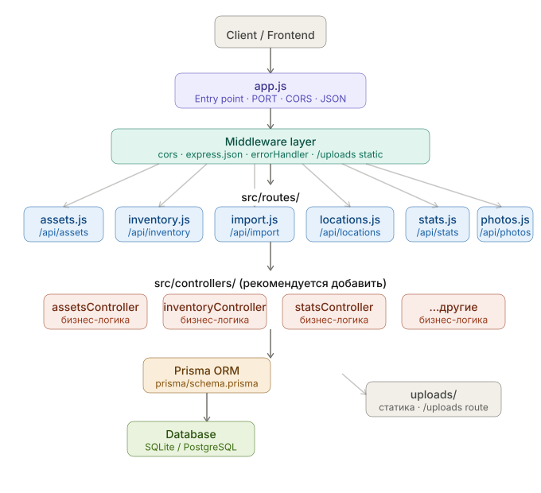

# 1c-asset-inventory-server

Backend-сервер для учёта и инвентаризации основных средств (ОС) с импортом из 1С.

---

## Стек технологий

- **Node.js** 18+
- **Express.js** — HTTP-сервер
- **Prisma ORM** — работа с базой данных
- **SQLite / PostgreSQL** — база данных
- **Multer** — загрузка файлов
- **XLSX** — экспорт/импорт Excel
- **PM2** — менеджер процессов в production

---

## Архитектура

<p align="center">
  
</p>

---

## Структура проекта

```
asset-inventory-system/
├── src/
│   ├── routes/
│   │   ├── assetsRoutes.js          # маршруты ОС
│   │   ├── inventoryRoutes.js       # маршруты инвентаризации
│   │   ├── importRoutes.js          # маршруты импорта Excel
│   │   ├── locationsRoutes.js       # маршруты кабинетов и справочников
│   │   ├── statsRoutes.js           # маршруты дашборда
│   │   └── photosRoutes.js          # маршруты фотографий
│   ├── controllers/
│   │   ├── assetsController.js      # логика ОС
│   │   ├── inventoryController.js   # логика инвентаризации
│   │   ├── importController.js      # логика импорта
│   │   ├── locationsController.js   # логика кабинетов
│   │   ├── statsController.js       # логика дашборда
│   │   └── photosController.js      # логика фотографий
│   ├── services/
│   │   ├── prisma.js                # единый инстанс PrismaClient
│   │   └── importService.js         # парсинг Excel и справочники
│   └── utils/
│       └── importHelpers.js         # parseDate, parseNumber, getChanges
├── prisma/
│   └── schema.prisma                # схема базы данных
├── docs/
│   └── architecture.svg             # диаграмма архитектуры
├── uploads/                         # загруженные файлы
├── logs/                            # логи PM2
├── app.js                           # точка входа
├── ecosystem.config.cjs             # конфиг PM2
├── .env                             # переменные окружения
├── .env.example                     # шаблон переменных
└── package.json
```

---

## Быстрый старт

### 1. Установить зависимости

```bash
npm install
```

### 2. Создать `.env`

```bash
cp .env.example .env
```

Заполнить `.env`:

```env
PORT=8888
NODE_ENV=production
DATABASE_URL="file:./prisma/dev.db"
```

### 3. Применить миграции

```bash
npm run db:generate
npm run db:migrate
```

### 4. Запуск в development

```bash
npm run dev
```

### 5. Запуск в production через PM2

```bash
npm run pm2:start
```

---

## PM2 — все команды

### Запуск и остановка

```bash
npm run pm2:start      # запустить сервер
npm run pm2:stop       # остановить сервер
npm run pm2:restart    # перезапустить сервер
npm run pm2:delete     # удалить процесс из PM2
```

### Мониторинг

```bash
npm run pm2:list       # список всех процессов и их статус
npm run pm2:logs       # логи в реальном времени
npm run pm2:logs:err   # только логи ошибок
npm run pm2:monit      # мониторинг CPU и памяти
```

### Автозапуск при перезагрузке

**Linux/Mac:**
```bash
pm2 startup
pm2 save
```

**Windows:**
```bash
npm install -g pm2-windows-startup
pm2-startup install
pm2 save
```

### Статусы процесса PM2

| Статус | Описание |
|--------|----------|
| `online` | Сервер работает |
| `stopped` | Остановлен вручную |
| `errored` | Упал с ошибкой |
| `launching` | Запускается |

---

## База данных — команды

```bash
npm run db:generate    # сгенерировать Prisma Client
npm run db:migrate     # создать и применить новую миграцию (dev)
npm run db:deploy      # применить готовые миграции (production)
npm run db:studio      # открыть Prisma Studio
npm run db:seed        # заполнить БД тестовыми данными
```

---

## Проверка работоспособности

```bash
curl http://localhost:8888/api/health

# Ответ:
# { "status": "ok", "timestamp": "2024-11-15T10:30:00.000Z" }
```

---

## API — все эндпоинты

### Assets `/api/assets`

| Метод | Путь | Описание |
|-------|------|----------|
| GET | `/` | Список ОС с фильтрами и пагинацией |
| GET | `/scan/:barcode` | Поиск по штрих-коду или инвентарному номеру |
| GET | `/grouped` | Уникальные ОС с количеством |
| GET | `/by-name/:name/locations` | Разбивка по кабинетам |
| GET | `/:id` | Одна ОС с полными связями |
| GET | `/:id/history` | История инвентаризаций |

**Параметры фильтрации GET `/`:**

```
?search=компьютер
?locationId=1
?responsiblePersonId=2
?organizationId=1
?employeeId=3
?page=1&limit=50
?sortBy=name&sortDir=asc
```

### Inventory `/api/inventory`

| Метод | Путь | Описание |
|-------|------|----------|
| GET | `/` | Список всех сессий |
| POST | `/` | Создать новую сессию |
| POST | `/:id/scan` | Сканировать штрих-код |
| PATCH | `/:id/item/:itemId/cancel` | Отменить сканирование |
| PATCH | `/:id/item/:itemId` | Обновить статус item |
| PATCH | `/:id/asset/:assetId/location` | Указать новое место ОС |
| PATCH | `/:id/finish` | Завершить сессию |
| PATCH | `/:id/relocate-all` | Переместить все MISPLACED |
| GET | `/:id` | Сессия с прогрессом |
| GET | `/:id/relocated` | Список перемещённых |
| GET | `/:id/misplaced` | Список не на месте |
| GET | `/:id/export` | Экспорт в Excel |
| GET | `/:id/export-relocated` | Экспорт перемещённых в Excel |
| DELETE | `/:id` | Удалить сессию |

**Статусы ОС в сессии:**

| Статус | Описание |
|--------|----------|
| `PENDING` | Ещё не проверен |
| `FOUND` | Найден на месте |
| `NOT_FOUND` | Не найден |
| `MISPLACED` | Найден в другом кабинете |

### Import `/api/import`

| Метод | Путь | Описание |
|-------|------|----------|
| POST | `/preview` | Анализ Excel без сохранения |
| POST | `/apply` | Применить изменения |
| DELETE | `/orphaned` | Удалить лишние ОС |

**Поля Excel для импорта:**

```
Инвентарный номер, ОС, Организация, МОЛ, Местонахождение,
Сотрудник, Тип, Тип ФА, Штрих-код, Заводской номер,
Счет учета БУ, Стоимость БУ, Остаточная стоимость,
Процент износа, Срок износа, Год окончания износа,
Дата принятия, Дата закрепления
```

### Locations `/api/locations`

| Метод | Путь | Описание |
|-------|------|----------|
| GET | `/` | Все кабинеты |
| GET | `/with-counts` | Кабинеты с количеством ОС |
| GET | `/organizations` | Справочник организаций |
| GET | `/responsible-persons` | Справочник МОЛ |
| GET | `/employees` | Справочник сотрудников |
| GET | `/:id/assets` | ОС в кабинете |

### Stats `/api/stats`

| Метод | Путь | Описание |
|-------|------|----------|
| GET | `/` | Данные для дашборда |

### Photos `/api/photos`

| Метод | Путь | Описание |
|-------|------|----------|
| GET | `/` | Список ключей фото |
| GET | `/:nameKey` | Получить фото |
| POST | `/:nameKey` | Загрузить или заменить фото |
| DELETE | `/:nameKey` | Удалить фото |

### Health

| Метод | Путь | Описание |
|-------|------|----------|
| GET | `/api/health` | Проверка работоспособности |

---

## Деплой на Linux-сервер

### Первый раз

```bash
# 1. Установить Node.js 18+
curl -fsSL https://deb.nodesource.com/setup_18.x | sudo -E bash -
sudo apt-get install -y nodejs

# 2. Установить PM2
npm install -g pm2

# 3. Клонировать репозиторий
git clone <repo> /var/www/inventory-server
cd /var/www/inventory-server

# 4. Установить зависимости
npm install

# 5. Создать .env
cp .env.example .env
nano .env

# 6. Применить миграции
npm run db:generate
npm run db:deploy

# 7. Запустить
npm run pm2:start

# 8. Автозапуск при перезагрузке сервера
pm2 startup
# Скопировать и выполнить команду которую выдаст PM2
pm2 save

# 9. Открыть порт в фаерволе
sudo ufw allow 8888
```

### Обновление кода на Linux

```bash
cd /var/www/inventory-server
git pull
npm install
npm run db:deploy
npm run pm2:restart
```

---

## Деплой на Windows

### Первый раз

```powershell
# 1. Установить Node.js 18+ — скачать с https://nodejs.org

# 2. Установить PM2 и автозапуск
npm install -g pm2
npm install -g pm2-windows-startup
pm2-startup install

# 3. Клонировать репозиторий
git clone <repo>
cd inventory-server

# 4. Создать папки
New-Item -ItemType Directory -Force -Path "logs"
New-Item -ItemType Directory -Force -Path "uploads"

# 5. Установить зависимости
npm install

# 6. Создать .env
copy .env.example .env
# Открыть и заполнить .env в редакторе

# 7. Применить миграции
npm run db:generate
npm run db:deploy

# 8. Запустить
npm run pm2:start

# 9. Сохранить процессы для автозапуска
pm2 save
```

### Обновление кода на Windows

```powershell
cd C:\путь\до\inventory-server
git pull
npm install
npm run db:deploy
npm run pm2:restart
```

### Если порт занят на Windows

```powershell
# Найти процесс на порту 8888
netstat -ano | findstr :8888

# Убить процесс (заменить XXXX на найденный PID)
taskkill /PID XXXX /F

# Или просто перезапустить через PM2
npm run pm2:restart
```

---

## Диагностика проблем

```bash
# Логи ошибок
npm run pm2:logs:err

# Проверить порт
# Linux:
sudo lsof -i :8888
# Windows:
netstat -ano | findstr :8888

# Перезапустить с нуля
npm run pm2:delete
npm run pm2:start

# Переменные окружения
pm2 env 0
```

---

## Переменные окружения

| Переменная | Описание | Пример |
|------------|----------|--------|
| `PORT` | Порт сервера | `8888` |
| `NODE_ENV` | Окружение | `production` / `development` |
| `DATABASE_URL` | Строка подключения к БД | `file:./prisma/dev.db` |

---

## Лицензия

MIT